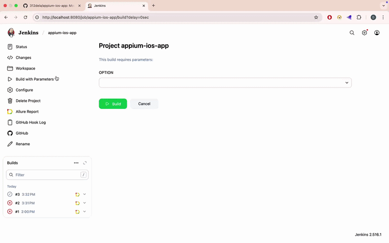
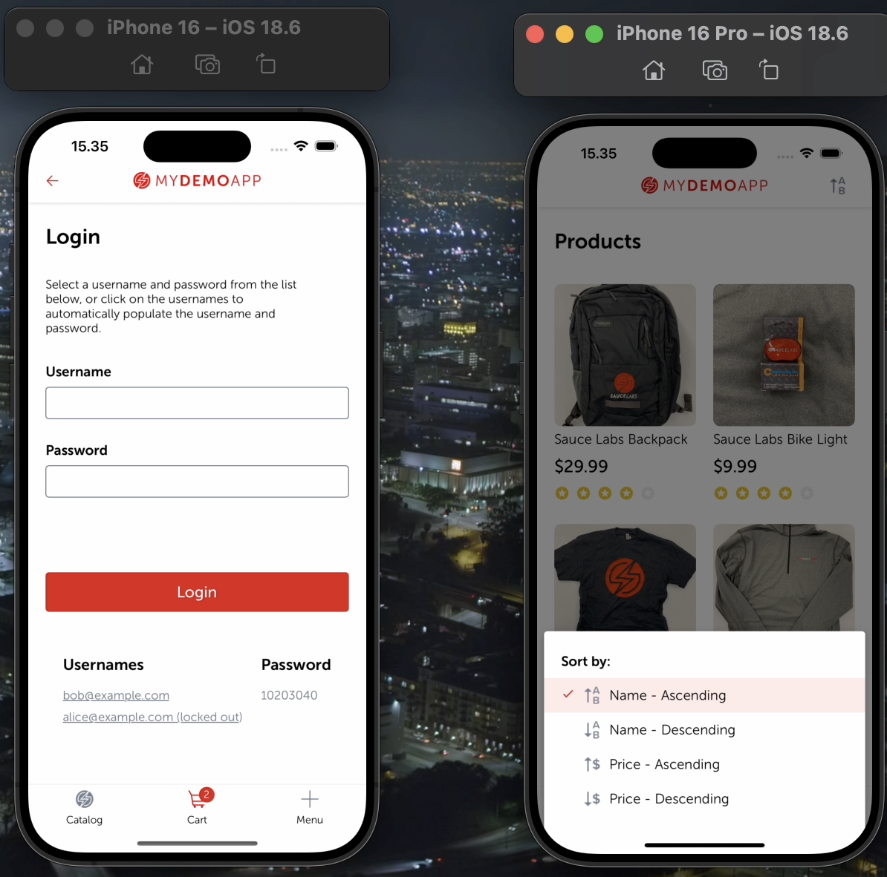
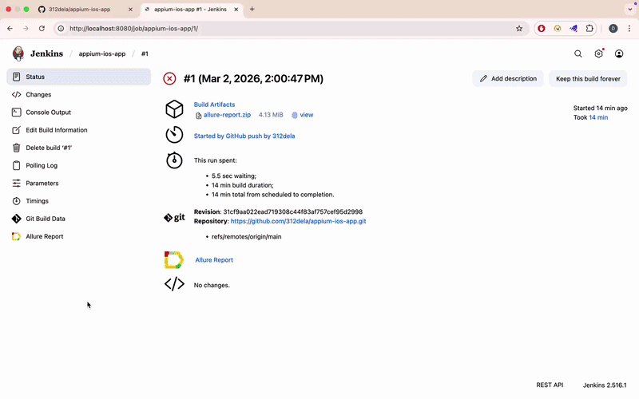

# Mobile App (iOS) Automation Testing for E-Commerce
This project demonstrates mobile app (iOS) automation testing for e-commerce platform (using My Demo App by [Sauce Labs](https://github.com/saucelabs/my-demo-app-ios) as the application under test). It covers comprehensive test coverage through positive, negative, and edge cases. It supports parallel execution, retry mechanisms, flexible configuration (e.g., environment and corresponding test data sources), and CI/CD pipeline integration. 



*Quick demo.*

## Table of Contents
- [Features](https://github.com/312dela/appium-ios-app#features)
- [Technology Stack](https://github.com/312dela/appium-ios-app#technology-stack)
- [Test Coverage](https://github.com/312dela/appium-ios-app#test-coverage)
- [Implementation Rationale](https://github.com/312dela/appium-ios-app#implementation-rationale)
- [Project Structure](https://github.com/312dela/appium-ios-app#project-structure)
- [Setup](https://github.com/312dela/appium-ios-app#setup)
- [Acknowledgement](https://github.com/312dela/appium-ios-app#acknowledgement)

## Features

- **Comprehensive Coverage:** Combination of positive, negative, and edge case to ensure the application's functionalities are thoroughly validated.

- **Separation of Concerns:** Each layer has a distinct responsibility, making it easy to maintain and extend.

- **Safe Parallel Execution:** Run multiple test classes simultaneously across separate iOS devices with automatic resource management.

- **Intelligent retry mechanisms:** Automatic retry flaky tests to improve test reliability.

- **Configuration Flexibility:** Test settings (e.g., environment, app path, appium server) and corresponding test data sources from JSON files are configurable via system properties or the properties file, facilitating CI/CD integration and intuitive execution scripts.

- **Zero-Boilerplate Configuration:** JSON → Java Records → Automated data binding for UI Layers without manual parsing.

- **Rich Reporting:** Allure Report is integrated with detailed logging and screenshots on failure to provide clear insights into test results.

## Technology Stack
- **Language:** Java 21
- **Testing Framework:** JUnit Jupiter 5.13.4
- **Mobile Automation:** Appium Java Client 8.6.0 (XCUITest driver for iOS)
- **Reporting:** Allure JUnit5 2.29.1
- **Build Tool:** Maven 3.5.3
- **JSON Processing:** Jackson Databind 2.19.2
- **CI/CD Integration:** Jenkins & Ngrok

## Test Coverage

**`SortingValidationTest.java`**

| Test Case | Type | Testing Technique | Purpose |
|-----------------------|-----------|-------------------|----------------------------|
| **Sort products by name in descending order** | Positive | Sorting Verification | Tests product sorting functionality by name (Z-A) |
| **Sort products by price in ascending order** | Positive | Sorting Verification | Tests product sorting functionality by price (low to high) |


**`OrderValidationTest.java`**

| Test Case | Type | Testing Technique | Purpose |
|-----------------------|-----------|-------------------|----------------------------|
| **Create order using locked out username** | Negative | Error Handling, Security Testing | Tests user authentication validation for locked accounts |
| **Create order using active username in different variants** (uppercase & lowercase) | Edge case | Data-Driven Testing, Format Variation | Tests username case-insensitivity during order creation |
| **Calculate the total price of the products in the cart** | Positive | Calculation Verification  | Tests calculation logic accuracy |
| **Use invalid card for payment method** | Negative | Error Handling, Validation Testing | Tests payment validation for expired card |

## Implementation Rationale

### 1. Architecture Design

Avoiding the "God Class" anti-pattern (monolithic helper class containing many methods with diverse responsibilities) for easier maintenance.

```java
// Example: using the "God Class" anti-pattern approach
public class TestHelper {
    public Response signUp() { }
    public Response createOrder() { }
    public Document findUser() { }
    public void assertStatus() { }
    public String generateEmail() { }
    // ... additional methods
}
```

Thus, a modular architecture with clear responsibilities is implemented for separation of concerns, which organized into: Helpers Layer, Page Objects Layer, Data Models Layer, Tests Layer, Utilities Layer, and Resources Layer.

#### **Helpers Layer** (`src/main/java/project/helpers/`)
- **`ExecutionHelper`:** Multi-step workflows used by test classes to keep tests concise.
- **`Loader`:** Loads config and test data.

#### **Page Objects Layer** (`src/main/java/project/pages/`)
- **`PageObjectManager`:** Instantiation of all page objects.
- **`BasePage`:** Common interactions (clicks, typing, etc).  
- **`DashboardPage`, `CartPage`, etc:** Elements and page-specific interactions.

#### **Data Models Layer** (`src/main/java/project/models/`)
Java records for data models.

#### **Tests Layer** (`src/test/java/project/tests/`)
- **`OrderValidationTest`:** Order validation test scenarios.
- **`SortingValidationTest`:** Sorting validation test scenarios.  
- **`BaseTest`:** Abstract base class that manages test lifecycle.

#### **Utilities Layer** (`src/test/java/project/utils/`)
- **`AssertionManager`:** Centralized reusable assertions for consistent reporting.
- **`DriverManager`:** Driver initialization and lifecycle management.
- **`DeviceConfig`:** Configuration model for device-specific parameters (UDID, device name, platform version, etc.) built from environment properties.
- **`ScreenshotUtil`:** Utility class for capturing screenshots and attaching them to Allure reports.
- **`DevicePool`:** Manages a thread-safe queue of available devices for parallel test execution.
- **`ScreenshotOnFailureExtension.java`:** JUnit extension that automatically takes a screenshot when a test fails.

#### **Resources Layer** (`src/test/resources`)
- **`MyDemoApp.app`:** Stores the application under test.
- **`config.properties`:** Stores environment setting, application path, and Appium server URL.
- **`junit-platform.properties`:** Stores parallel execution configuration (e.g., thread pool size, parallelism strategy, etc).
- **`test_data_{env}.json`:** JSON files with test data for different environments.
 
### 2. Config & Data Management
Decouple test logic from configuration (`config.properties`) and test data (`test_data_{env}.json`) for flexible execution across different settings without code modifications. Hardcoding within test classes is also minimized, as it often leads to difficult maintenance.

#### **Process Flow**

- **Suite Initialization:** The `initAll` method in `BaseTest.java` triggers the loading sequence.

    ```java
    protected void initAll() {
        Loader.loadConfig();    // Load config.properties
        Loader.loadData();      // Load test_data_{env}.json
    }
    ```

- **Resource Selection:** The active resource is resolved dynamically. If no system property is provided, the default value from `config.properties` is utilized and the hardcoded value serves as the final safety net.

    ```java
    // Usage example
    public static String getEnvironment() {

        // 1. Check Command Line Argument (-Denvironment=...)
        String env = System.getProperty("environment");

        // 2. Fallback mechanism
        if (env == null || env.isBlank())
            env = props.getProperty("default.env", "production");
        return env;

    }

    // For complete implementation details: Loader.java 
    ```

    The table below presents the configuration resolution hierarchy for each key.

    | Configuration Item | Property Key | Fallback Value | Dynamic Source |
    |-----------------------|-----------|-------------------|----------------------------|
    | **Environment** | `default.env` | `production` | `System.getProperty("environment")` |
    | **Application Paths** | `app.{env}` | `src/test/resources/MyDemoApp.app` | Resolved Environment |
    | **Appium Server** | `default.appium.server` | `chrome`  | `System.getProperty("appiumServer")` |
    | **Test Data** | N/A | `test_data_production.json` | Resolved Environment |


- **UI Form Filling:** Passing test data through test layer → helper layer → page object layer.

    ```java
    // Test Layer: OrderValidationTest.java
    String expireCard = Loader.payment().invalidCard(); // Access test data from JSON file
    getExecution().fillPaymentDetails(expireCard);

    // Helper Layer: ExecutionHelper.java
    public void fillPaymentDetails(String expDate) {
        page.getPaymentPage().enterPaymentDetails(Loader.account().name(), Loader.payment().cardNumber(), expDate, Loader.payment().cvv());
    }

    // Page Object Layer: RegistrationPage.java
    public void enterPaymentDetails(String name, String cardNumber, String expDate, String cvv) {
        safeType(nameField, name);
        safeType(cardNumberField, cardNumber);
        safeType(cvvField, cvv);
        safeType(expDateField, expDate);
        hideKeyboard();
    }
    ```

### 3. Annotations Usage
**Lifecycle Management**
- `@TestInstance(Lifecycle.PER_CLASS)` to allow the use of non‑static `@BeforeAll` and `@AfterAll` methods, which is essential for sharing expensive setup (like device acquisition) across tests in the same class.
- `@BeforeAll` / `@AfterAll` to execute once per test class.
- `@BeforeEach` / `@AfterEach` to be executed in each test method. 
- `@RegisterExtension` to register a custom JUnit extension (`ScreenshotOnFailureExtension`) which captures a screenshot automatically when a test fails.
```java
// Usage example
@TestInstance(TestInstance.Lifecycle.PER_CLASS)
public abstract class BaseTest {
 @RegisterExtension
    ScreenshotOnFailureExtension screenshot = new ScreenshotOnFailureExtension(() -> DriverManager.driver());

    @BeforeAll
    protected void initAll() {
        Loader.loadConfig();
        Loader.loadData();
        DevicePool.init();
        device = DevicePool.acquire();
    }

    @AfterAll
    protected void releaseDevice() {
        DevicePool.release(device);
    }

    @BeforeEach
    protected void setUp() throws MalformedURLException, URISyntaxException {
        DriverManager.initDriver(device);
        PageObjectManager pom = new PageObjectManager(DriverManager.driver());
        pageManagerTL.set(pom);
        executionHelperTL.set(new ExecutionHelper(pom));
        assertionManagerTL.set(new AssertionManager());
    }

    @AfterEach
    protected void tearDown() {
        if (DriverManager.driver() != null) {
            DriverManager.quitDriver();
        }
    }
}    

// For complete implementation details: BaseTest.java 
```
**Test and Reporting**
- `@Tag` to mark tests or classes with labels (e.g., "regression", "smoke", "order-flow").
- `@DisplayName` to provide human‑readable names for test classes and methods.
- `@Nested` to create hierarchical test structures, grouping related test cases within an outer class.
- `@ParameterizedTest` + `@MethodSource` to enable efficient testing of multiple input variants with identical logic.
```java
// Usage example
@Tag("order-flow")
@DisplayName("Order Validation Test")
public class OrderValidationTest extends BaseTest {

    @Tag("user")
    @Nested
    @DisplayName("User Validation in Order Creation")
    class UserValidationInOrderFlow {
        
        @Test
        @DisplayName("Create order using locked out username")
        public void createOrderUsingLockedOutUsername() { ... }

        @ParameterizedTest(name = "- {0}")
        @MethodSource("provideUsernames")
        public void createOrderUsingActiveUsername(String username) { ... }

        private static Stream<Arguments> provideUsernames() {
            return Stream.of(
                Arguments.of(Loader.account().activeUsername()),
                Arguments.of(Loader.account().activeUsername().toUpperCase())
            );
        }
    }
}     

// For complete implementation details: OrderValidationTest.java 
```

### 4. Retry Mechanism
Automatically re-run failed tests to distinguish between flaky failures and real failures. The retry logic is centralized in the `pom.xml` using the `rerunFailingTestsCount` property. All retry attempts are captured in Allure results directory.
```xml
<!-- pom.xml -->
<plugin>
    <groupId>org.apache.maven.plugins</groupId>
    <artifactId>maven-surefire-plugin</artifactId>
    <version>3.5.3</version>
    <configuration>
        <systemPropertyVariables>
            <allure.results.directory>target/allure-results</allure.results.directory>
        </systemPropertyVariables>
        <rerunFailingTestsCount>2</rerunFailingTestsCount>
    </configuration>
</plugin>
```
```text
┌─────────────────────────────────────────────────────────────┐
│                    RETRY FLOW                               │
├─────────────────────────────────────────────────────────────┤
│                                                             │
│   Test Execution #1 → FAIL                                  │
│         ↓                                                   │
│   Automatic Retry #1 → If still FAIL                        │
│         ↓                                                   │
│   Automatic Retry #2 → If still FAIL                        │
│         ↓                                                   │
│   Final Status: FAILED (after 3 total attempts)             │
│                                                             │
│   OR                                                        │
│                                                             │
│   Test Execution #1 → FAIL                                  │
│         ↓                                                   │
│   Automatic Retry #1 → PASS                                 │
│         ↓                                                   │
│   Final Status: PASS (flaky test detected)                  │
│                                                             │
└─────────────────────────────────────────────────────────────┘
```
### 5. Parallel Execution

Multiple test classes are executed simultaneously across separate physical devices without state contamination or resource conflicts, achieved through JUnit 5 parallel configuration and thread-safe resource management.

#### JUnit 5 Configuration

Parallel execution is enabled through `junit-platform.properties`.
```properties
junit.jupiter.execution.parallel.enabled=true
junit.jupiter.execution.parallel.mode.default=same_thread
junit.jupiter.execution.parallel.mode.classes.default=concurrent
junit.jupiter.execution.parallel.config.strategy=fixed
junit.jupiter.execution.parallel.config.fixed.parallelism=2
```

`mode.classes.default=concurrent` allows test classes to run simultaneously across threads, while `mode.default=same_thread` ensures test methods within a single class run sequentially. This design reflects a physical constraint: each device can only hold one active XCUITest session at a time, so only one test method per device may run at any given moment.

#### Device Pool

Each test class acquires an exclusive device from `DevicePool` at the start of the suite and releases it upon completion. The pool is backed by a `BlockingQueue`, so if all devices are occupied, any additional class will be blocked until one device becomes available (preventing multiple classes from competing over the same device).
```java
// Usage example
public final class DevicePool {
    private static BlockingQueue<DeviceConfig> queue;

    public static DeviceConfig acquire() {
        return queue.take(); // blocks if no device is available
    }

    public static void release(DeviceConfig cfg) {
        queue.offer(cfg); // returns device to pool after class completes
    }
}
// For complete implementation details: DevicePool.java
```

Device acquisition and release are tied to the test class lifecycle via `@BeforeAll` and `@AfterAll` in `BaseTest`.
```java
@BeforeAll
protected void initAll() {
    DevicePool.init();
    device = DevicePool.acquire();
}

@AfterAll
protected void releaseDevice() {
    DevicePool.release(device);
}
```

#### Thread-Safe Resource Management

When multiple test classes run simultaneously on separate threads, shared objects such as `IOSDriver`, `PageObjectManager`, `ExecutionHelper`, and `AssertionManager` would otherwise be overwritten across threads, causing race conditions and incorrect results. This is prevented by wrapping each of these objects in a `ThreadLocal`, which gives every thread its own independent instance.

| Resource | ThreadLocal Declaration | Purpose |
|---|---|---|
| `IOSDriver` | `ThreadLocal<IOSDriver> driverTL` | Each thread controls its own driver session |
| `PageObjectManager` | `ThreadLocal<PageObjectManager> pageManagerTL` | Stores thread-specific instances of `PageObjectManager` |
| `ExecutionHelper` | `ThreadLocal<ExecutionHelper> executionHelperTL` | Stores thread-specific instances of `ExecutionHelper` |
| `AssertionManager` | `ThreadLocal<AssertionManager> assertionManagerTL` | Stores thread-specific instances of `AssertionManager` |




_Running two test classes in parallel._

```text
JUnit 5 (mode.classes.default=concurrent, parallelism=2)
        |
        +-------------- Thread 1 --------------------------------- Thread 2
                            |                                          |
                       @BeforeAll                                @BeforeAll
                    DevicePool.acquire()                      DevicePool.acquire()
                    → Device A assigned                       → Device B assigned
                            |                                          |
                       @BeforeEach                               @BeforeEach
                   initDriver(Device A)                      initDriver(Device B)
                 driverTL.set(iosDriver_A)                  driverTL.set(iosDriver_B)
                 pageManagerTL.set(pom_A)                   pageManagerTL.set(pom_B)
                            |                                          |
                   OrderValidationTest                        SortingValidationTest
                  test1 → test2 → test3                           test1 → test2
                 (sequential, Device A)                      (sequential, Device B)
                            |                                          |
                       @AfterAll                                  @AfterAll
                  DevicePool.release(A)                      DevicePool.release(B)
```

> **Note:** The flow above reflects class-level parallelism. Test methods within each class always run sequentially on the same device. For full lifecycle steps, refer to `BaseTest.java`.

### 6. CI/CD Pipeline Integration

Continuous Integration and Continuous Deployment (CI/CD) are facilitated to ensure that test suites are executed automatically upon code changes to validate code quality continuously.

#### Process Flow

- **Code Commit:** Changes are pushed to the GitHub repository.

- **Webhook Trigger:** GitHub detects the push event and sends a JSON payload to the configured webhook URL (provided by Ngrok).
    
    > **Note:** Since the Jenkins server is hosted locally, a public endpoint is required for GitHub Webhooks to establish connectivity. Thus, Ngrok is utilized to create this secure tunnel.

- **Tunnel Routing:** Ngrok forwards the incoming request from the public URL to the local Jenkins server port (e.g., `localhost:8080`).

- **Test Execution:** Jenkins receives the webhook, triggers the configured job, and executes the test suite.

- **Report Generation:** After test execution is done, Allure report will be generated for analysis.


*CI/CD demo.*

### 7. Allure Report for Reporting

Using Allure Report for traceability and debugging efficiency which includes test result status, retry attempts and final outcome after retry exhaustion, detailed logging, and screenshots on failures linked inline within the report.



*Test execution result.*

## Project Structure

```text
appium-ios-app/
├── src/
│   ├── main/
│   │   └── java/project/
│   │       ├── helpers/           # Execution, Data & Config Loader
│   │       ├── models/            # Java Records for test data
│   │       └── pages/             # Page Object classes
│   │       
│   └── test/
│       ├── java/project/
│       │   ├── tests/             # Test classes
│       │   └── utils/             # Utility classes
│       └── resources/
│           ├── MyDemoApp.app      # Application under test
│           ├── *.properties       # Configuration properties
│           └── *.json             # Test data per environment
│
├── package.json                   # Execution scripts
├── pom.xml                        # Maven dependencies and build config
├── docs/                          # Files to support project documentation
├── README.md                      # Project documentation
└── .gitignore
```

## Setup

### Prerequisites

Before you begin, make sure the following are installed and configured:

- Java 21
- Maven
- Xcode 
- Appium 
- XCUITest driver
- iOS Simulator
- *Optional:* Node.js (for npm wrapper scripts in `package.json`)

### Usage

#### 1. Start Appium Server
```bash
appium
```

By default, the server runs at `http://127.0.0.1:4723`. A custom server URL can be specified via `-DappiumServer`.

#### 2. Find Your Device UDID
```bash
xcrun simctl list devices
```

#### 3. Clone This Repository


#### 4. Run Tests
```bash
# Run all tests on a single device
mvn clean test \
  -Dudid.A=<your-udid> \
  -DdeviceName.A='<your-device-name>' \
  -DplatformVersion.A=<your-platform-version>

# Run all tests on two devices in parallel
mvn clean test \
  -Dudid.A=<udid-device-a> \
  -DdeviceName.A='<your-device-name-a>' \
  -DplatformVersion.A=<your-platform-version-a> \
  -Dudid.B=<udid-device-b> \
  -DdeviceName.B='<your-device-name-b>' \
  -DplatformVersion.B=<your-platform-version-b> \
  -Dwda.B=8102 \
  -Dmjpeg.B=9102 \
  -Dderived.B=target/WDA-8102

# Run with a custom environment (e.g., qa)
mvn clean test \
  -Dudid.A=<your-udid> \
  -DdeviceName.A='<your-device-name>' \
  -DplatformVersion.A=<your-platform-version>
  -Denvironment=qa
```

> **Note:** NPM wrapper scripts are available in `package.json` for convenience. Before using them, edit the file to replace with your own device identifiers.

#### 5. Allure Report
```bash
# Generate the report
npx allure generate target/allure-results --clean -o target/allure-report

# Open the report
npx allure open target/allure-report
```

---

### Configuration

Test settings and test data are managed through external files located in `src/test/resources/`.

> **Note:** Although the application under test only provides a single app path, this project aims to demonstrate scalability and readiness for future integration with various environments/settings without requiring code modifications. 

- **`config.properties`**

  Settings for environment, Appium server URL, and app are defined here. All values can be overridden at runtime via Maven system properties (`-D`). If new configuration item is required to be added to test a particular setup, simply add a new line for it (e.g., `app.{env}`).
```properties
  default.env=production
  app.production=src/test/resources/MyDemoApp.app
  default.appium.server=http://127.0.0.1:4723
  app.{env}={your_app_path}
```

- **`test_data_{env}.json`**


  Environment-specific data variations (e.g., different product names for each environment) are already prepared in this project and stored in JSON files corresponding to each environment (e.g., `test_data_qa.json`, `test_data_production.json`). The file for being used as the test data source will be resolved automatically based on the environment being targeted.

### System Properties Reference

| Property | Required | Default | Description |
|---|---|---|---|
| `udid.{KEY}` | Yes | — | UDID of the target device |
| `deviceName.{KEY}` | Yes | — | Device name matching the target device |
| `platformVersion.{KEY}` | Yes | — | iOS version of the target device |
| `wda.{KEY}` | Yes (if running on two devices) | `8101` | WDA local port (must be unique per device) |
| `mjpeg.{KEY}` | Yes (if running on two devices) | `9101` | MJPEG server port (must be unique per device) |
| `derived.{KEY}` | Yes (if running on two devices) | `target/WDA-{wda}` | Derived data path for WDA build artifacts |
| `environment` | No | `production` | Target environment for test data resolution |
| `app` | No | `src/test/resources/MyDemoApp.app` | Path to the `.app` |
| `appiumServer` | No | `http://127.0.0.1:4723` | Appium server URL |


## Acknowledgement
Special thanks to [Sauce Labs](https://github.com/saucelabs) for developing the e-commerce platform.